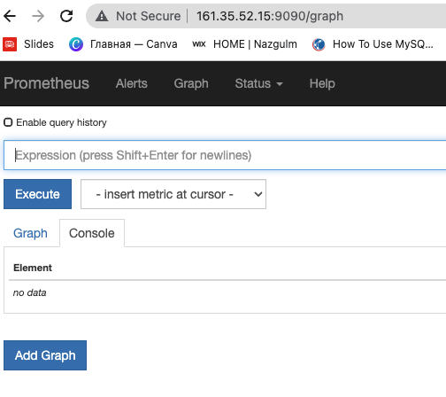
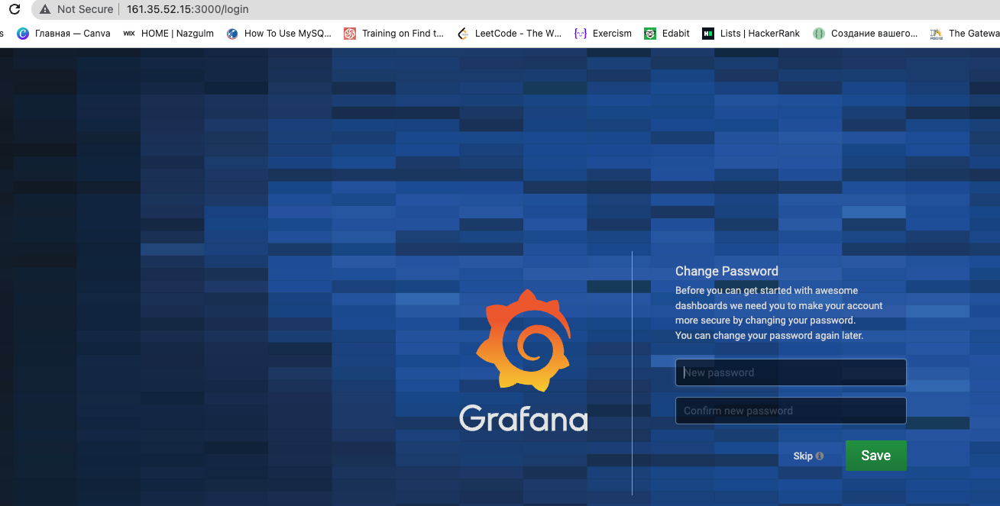
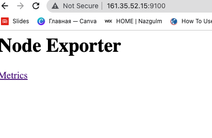

# Roles

Ansible Real time project (monitoring setup)
This project will help to implement monitoring setup for a organization using open source tools like Prometheus, Grafana, AlertManager

a; Install Prometheus to the target system
b; Install Grafana on Target system
c; install Node exporter for exposing system data
d; Install AlertManager for sending alerts to Pagerduty/Slack
e; Create everything as a service so starting and stopping and handling will be easy

