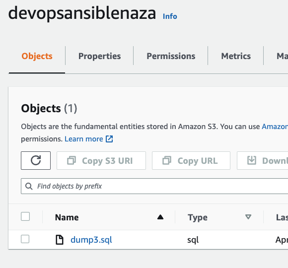

# Ansible Vault

The "Vault" is a feature of Ansible that allows to keep sensitive data such as passwords or keys protected at rest, rather than as plain text in playbooks or roles.

1; Configure security of secrets using the Ansible Vault 
2; Install mysql on VM and configure passwordless authentication so that ansible playbook will take mysql backup from the other machine.
3; Create database and table on mySQL
4; Install Ansible
5; Write the Ansible Playbook to take mysql backup and store the backup in s3 bucket

```
sudo yum update -y 
sudo rpm -Uvh https://dev.mysql.com/get/mysql57-community-release-el7-11.noarch.rpm 
rpm --import https://repo.mysql.com/RPM-GPG-KEY-mysql-2022
sudo yum install mysql-community-server 
sudo systemctl enable mysqld 
sudo systemctl start mysqld 
grep "A temporary password" /var/log/mysqld.log

# A temporary password is generated for root@localhost: ,91G3lrbJiV-

mysql_secure_installation

put the temporary password
give the new password
all the way enter and done
```

MySQL backup
```
mysql -u root -p
password
show databases;
+--------------------+
| Database           |
+--------------------+
| information_schema |
| mysql              |
| performance_schema |
| sys                |
+--------------------+
create database naza;
# for using th naza database:
use naza;
# Create table
create table tblEmployee1(Employee_first_name varchar(500) NOT null,Employee_last_name varchar(500) NOT null);
INSERT INTO tblEmployee1 (employee_first_name, employee_last_name) values ("Nisarg","Upadhyay");
```

Aws cli install and configure
```
curl “https://awscli.amazonaws.com/awscli-exe-linux-x86_64.zip” -o "awscliv2.zip"
 yum install unzip
   24  unzip awscliv2.zip
   25  ./aws/install
   26  aws configure
```

Ansible installation:
```
dnf install https://dl.fedoraproject.org/pub/epel/epel-release-latest-9-4.e19.noarch.rpm

yum install python3 python3-pip
pip3 install ansible
```

Create S3 backup bucket.

```
# Create main.yaml:
---
 - name: this is my first playbook
   hosts: localhost
   tasks:
     - name: Take Mysql backup
       shell: mysqldump -u root --password="Nurbakar2023!"  naza  tblEmployee1 > /tmp/dump3.sql
     - name: Push Mysql backup to s3 bucket
       shell: /usr/local/bin/aws s3 cp  /tmp/dump3.sql s3://devopsansiblenaza
```

Result shows that my mysql table was backed up to S3 bucket:



```
PLAY [this is my first playbook] **************************************************

TASK [Gathering Facts] ************************************************************
ok: [localhost]

TASK [Take Mysql backup] **********************************************************
changed: [localhost]

TASK [Push Mysql backup to s3 bucket] *********************************************
changed: [localhost]

PLAY RECAP ************************************************************************
localhost                  : ok=3    changed=2    unreachable=0    failed=0    skipped=0    rescued=0    ignored=0   

cat /tmp/dump3.sql
-- MySQL dump 10.13  Distrib 5.7.41, for Linux (x86_64)
--
-- Host: localhost    Database: naza
-- ------------------------------------------------------
-- Server version	5.7.41

/*!40101 SET @OLD_CHARACTER_SET_CLIENT=@@CHARACTER_SET_CLIENT */;
/*!40101 SET @OLD_CHARACTER_SET_RESULTS=@@CHARACTER_SET_RESULTS */;
/*!40101 SET @OLD_COLLATION_CONNECTION=@@COLLATION_CONNECTION */;
/*!40101 SET NAMES utf8 */;
/*!40103 SET @OLD_TIME_ZONE=@@TIME_ZONE */;
/*!40103 SET TIME_ZONE='+00:00' */;
/*!40014 SET @OLD_UNIQUE_CHECKS=@@UNIQUE_CHECKS, UNIQUE_CHECKS=0 */;
/*!40014 SET @OLD_FOREIGN_KEY_CHECKS=@@FOREIGN_KEY_CHECKS, FOREIGN_KEY_CHECKS=0 */;
/*!40101 SET @OLD_SQL_MODE=@@SQL_MODE, SQL_MODE='NO_AUTO_VALUE_ON_ZERO' */;
/*!40111 SET @OLD_SQL_NOTES=@@SQL_NOTES, SQL_NOTES=0 */;

--
-- Table structure for table `tblEmployee1`
--

DROP TABLE IF EXISTS `tblEmployee1`;
/*!40101 SET @saved_cs_client     = @@character_set_client */;
/*!40101 SET character_set_client = utf8 */;
CREATE TABLE `tblEmployee1` (
  `Employee_first_name` varchar(500) NOT NULL,
  `Employee_last_name` varchar(500) NOT NULL
) ENGINE=InnoDB DEFAULT CHARSET=latin1;
/*!40101 SET character_set_client = @saved_cs_client */;

--
-- Dumping data for table `tblEmployee1`
--

LOCK TABLES `tblEmployee1` WRITE;
/*!40000 ALTER TABLE `tblEmployee1` DISABLE KEYS */;
INSERT INTO `tblEmployee1` VALUES ('Nisarg','Upadhyay');
/*!40000 ALTER TABLE `tblEmployee1` ENABLE KEYS */;
UNLOCK TABLES;
/*!40103 SET TIME_ZONE=@OLD_TIME_ZONE */;

/*!40101 SET SQL_MODE=@OLD_SQL_MODE */;
/*!40014 SET FOREIGN_KEY_CHECKS=@OLD_FOREIGN_KEY_CHECKS */;
/*!40014 SET UNIQUE_CHECKS=@OLD_UNIQUE_CHECKS */;
/*!40101 SET CHARACTER_SET_CLIENT=@OLD_CHARACTER_SET_CLIENT */;
/*!40101 SET CHARACTER_SET_RESULTS=@OLD_CHARACTER_SET_RESULTS */;
/*!40101 SET COLLATION_CONNECTION=@OLD_COLLATION_CONNECTION */;
/*!40111 SET SQL_NOTES=@OLD_SQL_NOTES */;

-- Dump completed on 2023-04-10 18:41:37
```

