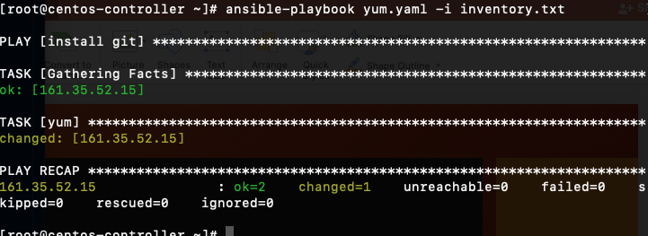
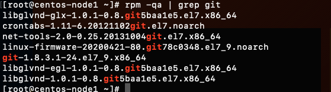
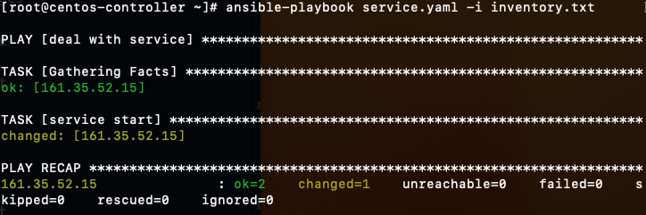
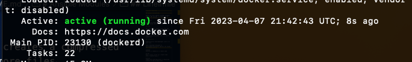
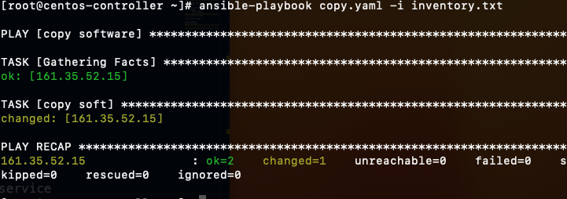
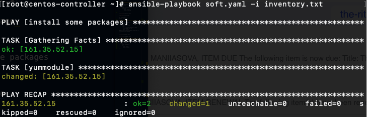
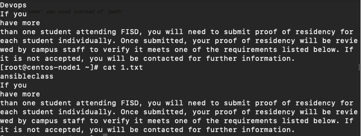

# Ansible Modules

## Package management

Module for most popular package managers, such as DNF and APT, to enable you to install any package on a system.

## Service

The service module enables to start, stop, reload installed packages.

## Copy

The copy module copies a file from the local or remote machine to a location on the remote machine.

## File

The file module manages the file and its properties

## Lineinfile

The lineinfile module manages lines in a text file.

shell module is designed to execute Shell commands against the target Unix based hosts.

Command
Executes a command on a remote node

Script
Runs a local script on a remote node after transferring it

Archive
The archive module creates a compressed archive of one or more files

1; Installing packages

```
Create yum.yaml file
---
 - name: install git
   hosts: all
   tasks:
    - name: yum
      yum:
       name: git
       state: latest
# Run the ansible-playbook yum.yaml -i inventory.txt 
```

We can see that, git installed to node1 machine





2; Service module
Create service.yaml

```
---
 - name: deal with service
   hosts: all
   tasks:
    - name: service start
      service:
         name: docker
         state: started
```





3; Copy module
Create copy.yaml

```
---
 - name: copy software
   hosts: all
   tasks: 
    - name: copy soft
      copy:
       src: /root/prometheus-2.37.6.linux-amd64.tar.gz
       dest: /root/
# Run the ansible-playbook copy.yaml -i inventory.txt command
```




4; Install yum package

```
---
- name: install some packages
  hosts: all
  tasks:
   - name: yummodule
     yum:
       name: httpd
       state: latest
```

```
httpd -version
Server version: Apache/2.4.6 (CentOS)
Server built:   Apr  5 2023 17:18:30
```



5; Using lineinline:

```
---
- name: Modify files
  hosts: all
  tasks: 
   - name: change some lines
     lineinfile:
        path: /root/1.txt
        regexp: '^Devops'
        insertafter: 'Devops'
        line: 'ansibleclass'
        backup: yes
```

It will replace Devops to ansibleclass



```
---
- name: Modify files
  hosts: all
  tasks: 
   - name: change somelines
     lineinfile:
        path: /root/1.txt
        #regexp: '^Devops'
        insertafter: 'EOF'
        line: 'END OF TEXT FILE'
        backup: yes
```
```
[root@centos-node1 ~]# cat 1.txt
ansibleclass
If you 
have more 
than one student attending FISD, you will need to submit proof of residency for each student individually. Once submitted, your proof of residency will be reviewed by campus staff to verify it meets one of the requirements listed below. If it is not accepted, you will be contacted for further information. 
END OF TEXT FILE
```

It added the END OF TEXT FILE line at the end.

