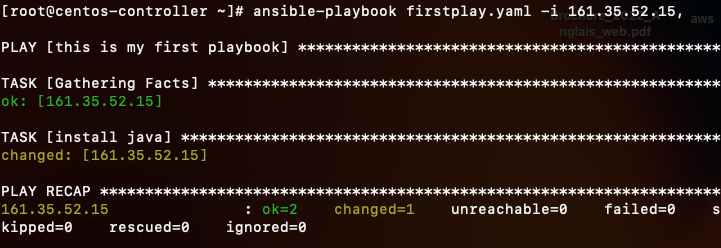
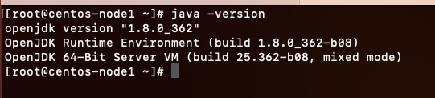
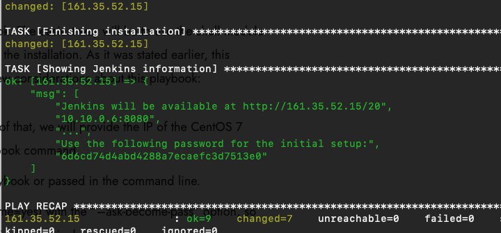

# Ansible playbooks

1. Create two VMs in Digital Ocean - one for controller another for node1 machine
2. In controller node have to create ssh key for connecting to node1

```
cd .ssh
ssh-keygen
cat id_rsa.pub 
# copy to cd .ssh, vi authorized_keys of node 1 machine
then try to ssh node1Ip
```

3; Install ansible to both machines

```
sudo yum install epel-release -y
sudo yum update –y
sudo yum install ansible -y
In both /etc/ansible/hosts add
ansibleController IP
[webservers]
node1IPAddress
```


4; Create firstplay.yaml file for installing java

```
---
 - name: this is my first playbook
   hosts: all
   tasks: 
     - name: install java
       yum:
        name: java
        state: latest
run
ansible-playbook firstplay.yaml -i 161.35.52.15,
# for installing java in node1 host
```





## Ansible Inventory

It is a collection of managed hosts we want to manage with Ansible for various automation and configuration

```
mail.example.com

[webservers]
foo.example.com
bar.example.com

[dbservers]
one.example.com
two.example.com
three.example.com
```

Can vi /etc/ansible/hosts
delete all content in this hosts file
Can put machine details directly, put ipAddress

can put ipAddress of node1 machine in inventory.txt

```
ansible-playbook -i inventory.txt firstplay.yaml
```

5; Install jenkins with Docker

```
---
- name: Installing Jenkins with Docker
  gather_facts: true
  hosts: all

  tasks:
  - name: Updating Linux
    shell: |
     yum update -y
  - name: Installing Docker
    shell: |
     yum install -y yum-utils > /dev/null
     yum-config-manager --add-repo https://download.docker.com/linux/centos/docker-ce.repo
     yum install -y docker-ce docker-ce-cli containerd.io docker-compose-plugin
  - name: Configuring Docker service
    shell: |
      systemctl start docker
      usermod -aG docker $USER
      systemctl enable docker
  - name: Downloading Docker image for Jenkins
    shell: |
      docker pull jenkins/jenkins
  
  - name: Creating docker-compose file for the Jenkins image
    shell: |
       mkdir -p /var/jenkins/jenkins-data
       mkdir -p /var/jenkins/jenkins-logs
       cd /var/jenkins/jenkins-data
       cat <<EOF > docker-compose.yaml
       version: '3'
       services:
         jenkins:
           image: jenkins/jenkins
           container_name: jenkins
           hostname: jenkins
           ports:
             - "8080:8080"
           volumes:
           - /var/jenkins/jenkins-data:/var/jenkins_home
           - /var/jenkins/jenkins-logs:/var/jenkins_logs
           labels:
             service: "jenkins-master"
           restart: unless-stopped
           networks:
             - net
       networks:
           net:
       EOF
  - name: Executing docker compose
    shell: |
      chown 1000:1000 /var/jenkins/jenkins-data
      chown 1000:1000 /var/jenkins/jenkins-logs
      cd /var/jenkins/jenkins-data
      docker compose up -d
      sleep 20
  - name: Finishing installation
    shell: |
      jenkinsIP=$(ip a s eth0 | grep "inet " | awk '{print $2}')
      jenkinsIP=${jenkinsIP%/*}
      echo "Jenkins will be available at http://$jenkinsIP:8080"
      echo "..."
      echo "Use the following password for the initial setup:"
      cat /var/jenkins/jenkins-data/secrets/initialAdminPassword
    register: result

  - name: Showing Jenkins information
    debug:
     msg: "{{ result.stdout_lines }}"
```


