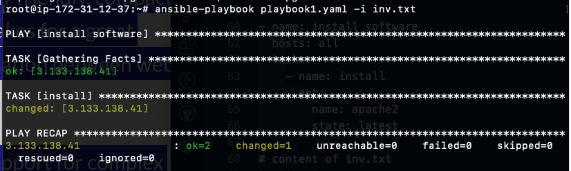
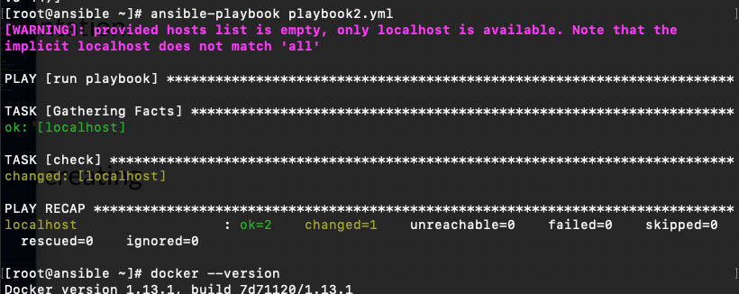

# Ansible

You will have the system where Ansible controller is installed, and it should have access through SSH 22 port to other Nodes. Port 22 should be open for Ansible controller.

Task 1; Create two instances on AWS: one for ansible-controller and other one as node1, it can use with 2 other Linux systems as Ubuntu, centos , Amazon machine Linux etc.

```
cd folder where your key is located
ssh -i "your-key.pem" ec2-user@ec2-3-137-219-233.us-east-2.compute.amazonaws.com
sudo su #redirect to root user
$ sudo apt update
$ sudo apt install software-properties-common
$ sudo add-apt-repository --yes --update ppa:ansible/ansible
$ sudo apt install ansible
```

2; ssh to second VM

```
cat .ssh/id_rsa.pub
# copy the content of id_rsa.pub file
and put into the second VM authorized keys
In the second VM - cd .ssh -> vi authorized_keys and paste the content of id_rsa.pub into it
chmod 700 .ssh
chmod 600 .ssh/authorized_keys
```

Ansible --push based, agentless
Chef -- pull based chef-client pulls code -- agents are needed on all nodes

yaml (yet another markup language) -.yaml or .yml

## adhoc commands

- commands you will not be using in the code, ad hoc tasks can be used to reboot servers, copy files, manage packages and users, and much more. You can use any Ansible module in an ad hoc task. ad hoc tasks, like playbooks, use a declarative model, calculating and executing the actions required to reach a specified final state. They achieve a form of idempotence by checking the current state before they begin and doing nothing unless the current state is different from the specified final state.
An ad-hoc command is something that you might type in to do something really quick, but don’t want to save for later.

## Modules in Ansible

What are the example of Ansible modules?
Image result for ansible modules what it is
These are firewalls, load balancers, containers themselves, container orchestrators, AWS, Azure, OpenStack, private cloud, and security configuration. There are some top ansible modules that are frequently used to automate different tasks.A module is a reusable, standalone script that Ansible runs on your behalf, either locally or remotely. Modules interact with your local machine, an API, or a remote system to perform specific tasks like changing a database password or spinning up a cloud instance.
Block of code, type of tasks to perform certain type of tasks, you can have multiple type of modules to perform some tasks. Pre-configured modules, built-in modules, that can help use.

## Playbook in Ansible

Collection of modules. An Ansible playbook is an organized unit of scripts that defines work for a server configuration managed by the automation tool Ansible. Ansible is a configuration management tool that automates the configuration of multiple servers by the use of Ansible playbooks.
Ansible playbooks run multiple tasks, assign roles, and define configurations, deployment steps, and variables. If you're using multiple servers, Ansible playbooks organize the steps between the assembled machines or servers and get them organized and running in the way the users need them to

Ansible modules execute tasks, one or more Ansible tasks can be combined to make a play.

## Ansible inventory

Inventory file can contain where you store all the target of machine, system information, where you run the playbooks. Can write all IP addresses or fqdn (fully qualified domain name: www.example.com).

```
# installing yum package with playbook
---

- name: install software
  hosts: all
  tasks:
    - name: install
      apt:
        name: apache2
        state: latest
      
# content of inv.txt
3.133.138.41
```



Task 2: Install docker using the ansible-playbook
Create the playbook2.yaml:

```
---
 - name: run playbook
   hosts: localhost
   connection: local
   tasks: 
    - name: check
      yum: 
         name: docker
         state: latest
# Use command:
ansible-playbook playbook2.yaml
```


