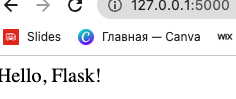

# DevOps Prerequisites

Software Development Life Cycle is a process used by the software industry to design, develop and test high quality process.

Development Phase Understanding
Need understand technology for DevOps engineers.
FrontEnd App- users can see app
Client side web app.
HTML - static web content, provides the actual content what we want to show.
Javascript - generating dynamic content
CSS - Cascading Style Sheets, used to style color, layout, alter the font, spacing.
Backend app- write logic Golang, Java, C++/.
Server side of the web app.
Backend will connect with Database(MySQL, Cassandra, oracle etc)
Database is organized collection of structured information, or data.
Employee userId is stored in a database.

MYSQL is a widely used database, relational database, collection of information that organizes data in predefined relationships where data stored in one or more tables. We do not have edit permission in MySQL database.

CREATE DATABASE devops; Create database with name devops
show databases; 
Show all databases

use devops;
It will use devops database to query and run.

CREATE TABLE users(name varchar(20), email varchar(40));
Create a table user with columns and email

select * from users;
Show all the columns from users

SELECT CustomerID,CustomerName FROM Customers;
Show two of the columns

use information_schema;
Use this database to run and query

For learning purposes created the hello.py with command which can shown on the website

```
sudo apt install python3-pip
python -m pip install flask
cd folderWhereThe/hello.py 
export FLASK_APP=hello
flask run
```

