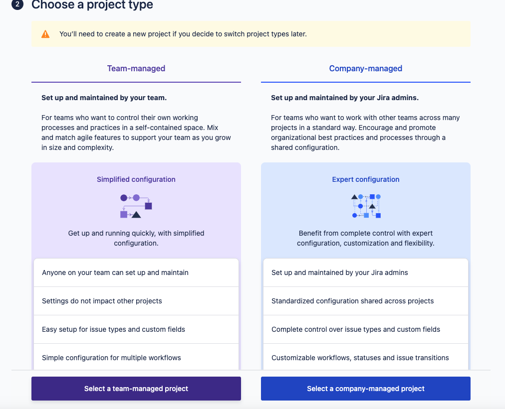
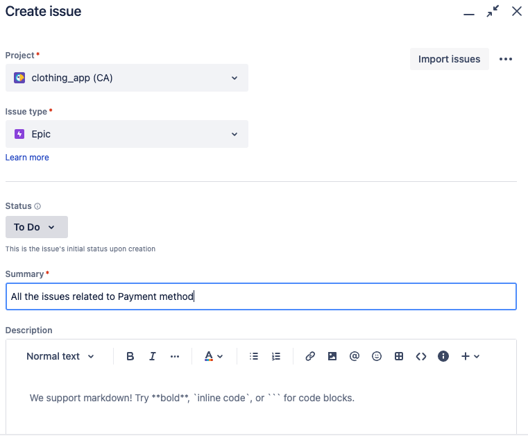
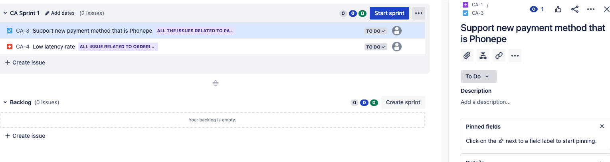
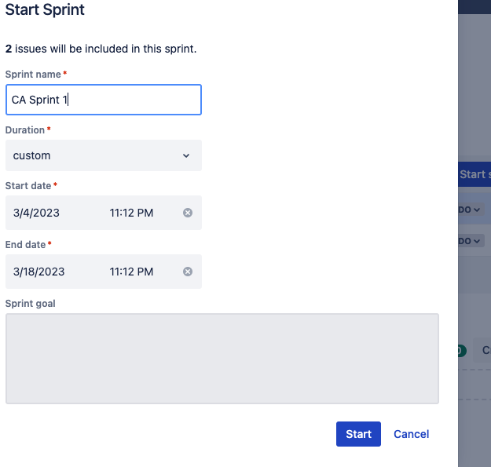

# All About Jira

## Jira is project management tool, for plan, track and support software development

Jira Usage:
Create new Tasks, Bug tracking, Track Tasks, Release Management.

Scrum is actually continuation of agile process, where product is broken into small pieces, means that minimal feature of product built and launched in market, this multiple to teo or three weeks several incremental releases call Sprint, like Sprint1, Sprint 2.
In one Sprint you have one feature.

Different roles in scrum team, product owner who are responsible for connecting with the customer gathering the requirement, create user stories or tasks on jira board.

Scrum Master role who will guide the entire team about the agile process anf checks if the principles are followed properly or not.

Development team who works on the development of product.

Product Backlog is prioritized list of development team and that is derived from the roadmap and its requirement. Entire list of tasks and requirement for the product development. 

Sprint Backlog Tasks which will be worked in a single Sprint, so Sprint Backlog is a subset of Product backlog.

Guidelines in Scrum:
-> Daily Standup Call - daily call with a team for at least 15 minutes about the update on task or any blockers if team has.
-> Sprint Planning - which team decide the task for one Sprint Backlog and overall timeline for completing that Sprint.
-> Sprint review where product owner will be reviewing the completed task, closing the task on Jira Board.

Different concepts in Scrum

Epic is large body of work that can blocked into a number of smaller stories or issues in jira. Entire product will be delivered in small Sprints. Can have multiple Epic.
Epic1 = Payment method, support in payment delivery
Epic2= Address

User Story - general or informal explanation regarding the software feature written from the perspective of the end user or the customer, which customer will provide you, you will track all aspects in jira board.

Tasks - Individual issues assigned to the developer to complete the entire user story it can development work oor testing work. 

Bugs- errors identified by customer on the application deployed in market.

Jira integrated with other tools, most companies use jira.
Planning handled by the project manager or scrum manager.
Companies now are following the Agile Method where entire application break down to small small pieces called microservices which makes development faster. One piece of product will take around 1 month to build and launched in market.
Agile is a philosophy how to successfully deliver software to a customer, scrum is a proven methodology for software development teams to follow. 

For demo processes I created the account in atlassian.net.

Create Project--> Scrum--> Team-managed--create clothing_app

Create epics, tasks and bugs related to the Sprint. 

Step by step:

