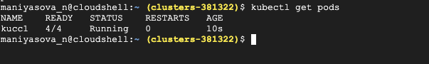
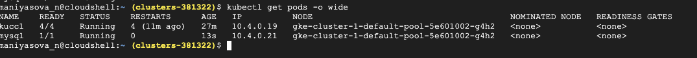
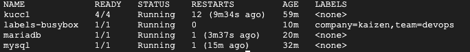

# Kubernetes

## What is Kubernetes? Why do we call it k8s?

Kubernetes, or K8s for short, is an open-source container-orchestration tool designed by Google. It's used for bundling and managing clusters of containerized applications K8s as an abbreviation results from counting the eight letters between the "K" and the "s".

## Benefits of using k8s

1; Kubernetes is beneficial for your business productivity:

One of the best things about using Kubernetes is that the platform helps you drive better business productivity.

2; Kubernetes has Multi-cloud Capability:

The other great thing about using Kubernetes is that you can finally ditch the conventions and benefit from the multi-cloud capability.

3; Kubernetes Runs Your Applications With Better Stability

The stability of an application will make the difference between a performant and a non-performant application. Fortunately, this will be the least of concerns for people using Kubernetes as the platform offers unmatched stability.

4; Kubernetes Is Open Source And Free

Kubernetes is free and open-source software that operates with the support of an extensive community. This means you are free to use Kubernetes however you want. You don't need to pay for a software license, and you can even edit Kubernetes' code to better fit your needs.


Kubernetes follows the client-server architecture, consists two main components:
1; Master Node (Control Plane)
2; Slave-worker node

The solutions that are already containerized can drastically reduce development time spent on operations and deployment.

It speeds up the overall software and application development process by making easy, faster, automated deployments, updates to running applications with almost zero downtime.

It functions based on a declarative model and implements the concept of a desired state.

Following steps illustrate the basic Kubernetes process:

An administrator creates and places the desired state of an application into a manifest file.

The file is provided to the Kubernetes API Server using a CLI or UI. Kubernetes default command-line tool is known as kubectl.


Kubernetes stores the file (an application’s desired state) in a database called the Key-Value Store (etcd).Kubernetes then implements the desired state on all the relevant applications within the cluster.

Kubernetes continuously monitors the elements of the cluster to make sure the current state of the application does not vary from the desired state.
Master Node or Kubernetes Control Plane
The master node in a Kubernetes architecture is used to manage the states of a cluster. It is an entry point for all types of administrative tasks. In the Kubernetes cluster, more than one master node is present for checking the fault tolerance.

API Server:

The Kubernetes API server receives the REST commands which are sent by the user. After receiving, it validates the REST requests, process, and then executes them. After the execution of REST commands, the resulting state of a cluster is saved in 'etcd' as a distributed key-value store.

Scheduler: it is a process that is responsible for assigning pods to the available worker nodes.

Controller Manager: The controllers in a master node perform a task and manage the state of the cluster. In the Kubernetes, the controller manager executes the various types of controllers for handling the nodes, endpoints, etc.

ETCD: It is an open-source, simple, distributed key-value storage which is used to store the cluster data.

Kube-proxy: It is a proxy service of Kubernetes, which is executed simply on each worker node in the cluster. The main aim of this component is request forwarding. Each node interacts with the Kubernetes services through Kube-proxy.

Worker nodes listens to the API Server for new work assignments. They execute the work assignments and then report the results back to the Kubernetes Master node. Each worker node is controlled by the Master Node.

1; Create following namespaces: dev, qa, prod, test, stage, tools, monitoring:

```
kubectl create ns dev && kubectl create ns qa && kubectl create ns prod && kubectl create ns test && kubectl create ns stage && kubectl create ns tools && kubectl create ns monitoring
```

But the best solution is create ns.yaml document with following content:

```
---
apiVersion: v1
kind: Namespace
metadata:
      name: dev1
---
apiVersion: v1
kind: Namespace
metadata:
    name: qa1
```

```
kubectl apply -f ns.yaml
```


2; Create nginx pod in each of the aforementioned namespaces

Create nginx.yaml file:

```
apiVersion: v1
kind: Pod
metadata:
  name: nginx
  namespace: dev
spec:
  containers:
  - name: nginx
    image: nginx
```

```
kubectl create -f nginx.yaml
```


3; Create a pod named "hello" that contains 2 images: redis, busybox, and each pod should run in qa and dev namespaces.
I created the hello.yaml file:

```
---
apiVersion: v1
kind: Pod
metadata:
  name: hello-dev
  namespace: dev
spec:
  containers:
  - name: redis
    image: redis
    ports:
    - containerPort: 80
    command: ["/bin/sh", "-ec", "sleep 1000"]
  - name: busybox
    image: busybox
    ports:
    - containerPort: 80
    command: ["/bin/sh", "-ec", "sleep 1000"]
---
apiVersion: v1
kind: Pod
metadata:
  name: hello-qa
  namespace: qa
spec:
  containers:
  - name: redis
    image: redis
    ports:
    - containerPort: 80
    command: ["/bin/sh", "-ec", "sleep 1000"]
  - name: busybox
    image: busybox
    ports:
    - containerPort: 80
    command: ["/bin/sh", "-ec", "sleep 1000"]
```

```
kubectl apply -f hello.yaml
```


4; Create a pod named kucc1 with a single container for each of the following images running inside: nginx + redis + memcached + hashicorp/consul

Create kucc1.yaml file

```
apiVersion: v1
kind: Pod
metadata:
  name: kucc1
spec:
  containers:
  - name: nginx
    image: nginx
    ports:
    - containerPort: 80
    command: ["/bin/sh", "-ec", "sleep 1000"]
  - name: redis
    image: redis
    ports:
    - containerPort: 80
    command: ["/bin/sh", "-ec", "sleep 1000"]
  - name: memcached
    image: memcached
    command: ["/bin/sh", "-ec", "sleep 1000"]
  - name: hashicorp
    image: consul
    command: ["/bin/sh", "-ec", "sleep 1000"]
```



5; Schedule pod with mysql image on worker1
Created mysql.yaml file, use

```
kubectl get nodes
```

For knowing the name of 2 worker nodes:


```
apiVersion: v1
kind: Pod
metadata:
  name: mysql
spec:
  nodeName: gke-cluster-1-default-pool-5e601002-g4h2  # schedule pod to specific node

  containers:
  - name: mysql
    image: mysql
    imagePullPolicy: IfNotPresent
    command: ["/bin/sh", "-ec", "sleep 1000"]
```



6; Schedule pod with mariadb image on worker2

Create the mariadb.yaml file and put this:

```

apiVersion: v1
kind: Pod
metadata:
  name: mariadb
spec:
  nodeName: gke-cluster-1-default-pool-5e601002-l86m  # schedule pod to specific node

  containers:

- name: mariadb
    image: mariadb
    imagePullPolicy: IfNotPresent
    command: ["/bin/sh", "-ec", "sleep 1000"]

```


7; Schedule pod with busybox image and labels: "team=devops, company=kaizen"  in a default namespace

```
apiVersion: v1
kind: Pod
metadata:
  name: labels-busybox
  labels:
    team: devops
    company: kaizen
spec:
  containers:
  - name: busybox
    image: busybox
    command: ["/bin/sh", "-ec", "sleep 1000"]
```




