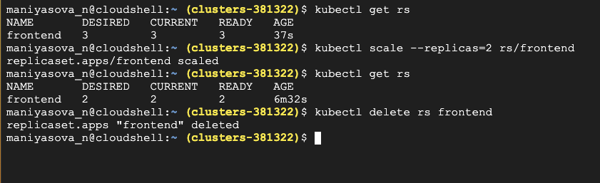

# ReplicaSet Work

You can define a ReplicaSet with fields, including:

A selector—lets you specify how the selector should choose pods.
A number of replicas—this indicates how many pods the ReplicaSet should maintain.
A pod template—the ReplicaSet uses the pod template when creating pods, and adding pods to meet the required number of replicas.
Once you define the fields, the ReplicaSet starts creating and deleting pods to reach the specified amount.

A Kubernetes pod is a cluster deployment unit that typically contains one or more containers. Pods (and, by extension, containers) are, nevertheless, short-lived entities. Starting in the Pending phase, pods progress to the Running phase if at least one of their primary containers begins successfully. A container hosting a sample application, for example, could fail. As a host, you’d think the kubelet process would automatically recreate it, however pods aren’t automatically rescheduled when they die. This has an impact on the containers within it because they are not rescheduled and may be discarded owing to a lack of resources. To keep your application operating, you’ll need to keep track of the health of your pods.

The Kubernetes replication controller is in charge of ensuring that pod lifecycles are maintained by scheduling a replacement for any pods that fail. There are several distinct controllers, each having a different use case. They all have one thing in common: they all keep a watch on a specific cluster of pods to make sure the proper number of them are always running.

A ReplicaSet (RS) is a Kubernetes object used to maintain a stable set of replicated pods running within a cluster at any given time.

A ReplicaSet has two main features: a pod template for creating new pods whenever existing ones fail, and a replica count for maintaining the desired number of replicas that the controller is supposed to keep running. A ReplicaSet also works to ensure additional pods are scaled down or deleted whenever an instance with the same label is created.

As a result, it ensures that a specified number of replica pods are running continuously. A Kubernetes RS helps with load-balancing, reliability, and scaling, as follows:

Load balancing: Replication allows Kubernetes to have multiple instances of a pod. This means that traffic is sent to different instances, which prevents a single instance from being overloaded.
Reliability: Replication ensures that we have multiple instances of an application, which means that it won’t fail just because one of the containers fails.
Scaling: With Kubernetes, you can quickly scale your application up or down by adding or removing instances.

```
apiVersion: apps/v1
kind: ReplicaSet
metadata:
  name: frontend
  labels:
    app: guestbook
    tier: frontend
spec:
  # modify replicas according to your case
  replicas: 3
  selector:
    matchLabels:
      tier: frontend
  template:
    metadata:
      labels:
        tier: frontend
    spec:
      containers:
      - name: php-redis
        image: gcr.io/google_samples/gb-frontend:v3
```

Specifying the apiVersion and kind just tells Kubernetes what it has to work with, and they should never be anything different. Moving further down to the definition of the metadata, you are specifying the name and labels. This will help you maintain a better overview of the resources you have in your environment.

Moving on in the manifest, you get to the spec field, where the first part is: replicas field is set to 3, but you can set it to whatever fits your application. Officially, there is no limit to how high this can be set but, of course, you have to keep in mind the underlying resources of your Kubernetes cluster.

The next part in the manifest is the selector field. This is where you specify how the ReplicaSet should recognize the pods it needs to control. In this case, it should match any pods with the label tier: frontend.

This is much like any other pod you would define. First, you specify the metadata field, which in this case is given the label of tier: frontend. As you saw earlier, this is what we specified the ReplicaSet would look for when finding which pods it needs to own. So make sure that it matches with what you wrote earlier in the manifest.

On the surface, a ReplicaSet is simply a resource in Kubernetes that maintains a set number of pods, nothing more

```
kubectl apply -f replica.yaml
```



## ReplicaSets compared to Deployments

Deployment works one level above ReplicaSet object. Deployment is recommended for application services.

With deployment you should be able to do rolling upgrade or rollback. You can update image from v1 to v2.

With ReplicaSet you define number of replicas you want to run. For a particular service. You would have those many replicas running.

Create the Deployment by running the following command:

```
kubectl apply -f deployment.yaml
kubectl get deployments
# to check if the Deployment was created.
Name - nginx-deployment
READY - 3/3 
UP-TO-DATE - 3
AVAILABLE - 3
AGE - 6m11s
```

NAME lists the names of the Deployments in the namespace.
READY displays how many replicas of the application are available to your users. It follows the pattern ready/desired.
UP-TO-DATE displays the number of replicas that have been updated to achieve the desired state.
AVAILABLE displays how many replicas of the application are available to your users.
AGE displays the amount of time that the application has been running.

To see the Deployment rollout status, run:

```
kubectl rollout status deployment/nginx-deployment
deployment "nginx-deployment" successfully rolled out
```

Deployment has created all three replicas, and all replicas are up-to-date (they contain the latest Pod template) and available.

```
kubectl get rs
NAME                          DESIRED   CURRENT   READY   AGE
nginx-deployment-6595874d85   3         3         3       11m
# To see the labels automatically generated for each Pod, run kubectl get pods --show-labels. The output is similar to:
NAME      READY   STATUS    RESTARTS   AGE   LABELS
nginx-deployment-6595874d85-cv9fw   1/1     Running   0          12m   app=nginx,pod-template-hash=6595874d85
nginx-deployment-6595874d85-f85mx   1/1     Running   0          12m   app=nginx,pod-template-hash=6595874d85
nginx-deployment-6595874d85-ft52q   1/1     Running   0          12m   app=nginx,pod-template-hash=6595874d85
```

## Updating a Deployment

1; Update the nginx Pods to use the nginx:1.16.1 image instead of the nginx:1.14.2 image.

```
kubectl set image deployment.v1.apps/nginx-deployment nginx=nginx:1.16.1
deployment.apps/nginx-deployment image updated
or
kubectl set image deployment/nginx-deployment nginx=nginx:1.16.1
Alternatively, you can edit the Deployment and change .spec.template.spec.containers[0].image from nginx:1.14.2 to nginx:1.16.1
kubectl edit deployment/nginx-deployment
kubectl rollout status deployment/nginx-deployment
deployment "nginx-deployment" successfully rolled out
kubectl get rs
NAME                          DESIRED   CURRENT   READY   AGE
nginx-deployment-6595874d85   0         0         0       16m
nginx-deployment-66b957f9d    3         3         3       91s

2; check the revisions of this Deployment:
3; undo the current rollout and rollback to the previous revision:
kubectl rollout undo deployment/nginx-deployment
4;You can scale a Deployment by using the following command
kubectl scale deployment/nginx-deployment --replicas=10
deployment.apps/nginx-deployment scaled
kubectl get rs
NAME                          DESIRED   CURRENT   READY   AGE
nginx-deployment-6595874d85   10        10        10      19m
5; Ensure that the 10 replicas in your Deployment are running.
kubectl get deploy
NAME               READY   UP-TO-DATE   AVAILABLE   AGE
nginx-deployment   10/10   10           10          20m
```

## How Daemon Pods are scheduled

A DaemonSet ensures that all eligible nodes run a copy of a Pod. The DaemonSet controller creates a Pod for each eligible node and adds the spec.affinity.nodeAffinity field of the Pod to match the target host. After the Pod is created, the default scheduler typically takes over and then binds the Pod to the target host by setting the .spec.nodeName field. If the new Pod cannot fit on the node, the default scheduler may preempt (evict) some of the existing Pods based on the priority of the new Pod.
