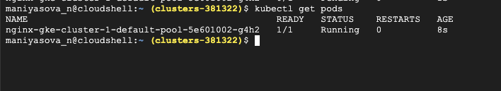
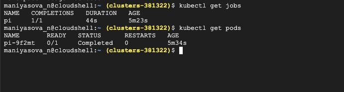
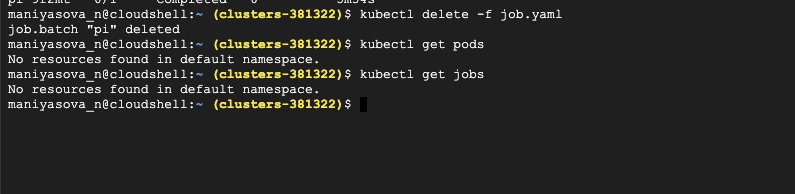
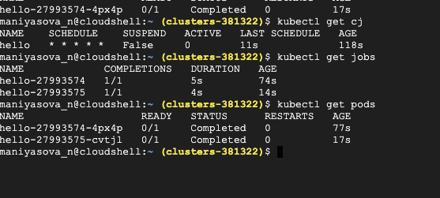

# Create pod in manifest folder

```
cd /etc/kubernetes/manifest
```

1; Create the nginx.manifest file

```
sudo vi nginx.manifest

apiVersion: v1
kind: Pod
metadata:
  name: nginx
spec:
  containers:
  - image: nginx
    name: nginx
```

2; The same with nginx.yaml file

```
sudo cp nginx.manifest nginx.yaml
```

It can also create pod in default namespace


2; Create jobs:

```
Create job.yaml
apiVersion: batch/v1
kind: Job
metadata:
  name: pi
spec:
  template:
    spec:
      containers:
      - name: pi
        image: perl:5.34.0
        command: ["perl",  "-Mbignum=bpi", "-wle", "print bpi(2000)"]
      restartPolicy: Never
  backoffLimit: 4
```

```
kubectl create -f job.yaml
```



This way created for us the jpb and pod in default ns, for deleting this job use:

```
kubectl delete -f job.yaml
```

It will delete job and pod from the file



3; Create cron jobs:
Cron job -> job -> pod, we can schedule the jobs:

```
apiVersion: batch/v1
kind: CronJob
metadata:
  name: hello
spec:
  schedule: "* * * * *"
  jobTemplate:
    spec:
      template:
        spec:
          containers:
          - name: hello
            image: busybox:1.28
            imagePullPolicy: IfNotPresent
            command:
            - /bin/sh
            - -c
            - date; echo Hello from the Kubernetes cluster
          restartPolicy: OnFailure
```

Create a job and pod every minute every container


Every minute it's created jobs and containers



```
kubectl delete -f cron.yaml
```

4; HPA  -Horizontal Pod Autoscaling

To know most top pod in ns kube-system memory

```
kubectl top pods -n kube-system | grep calico-node-d6h9l | awk '{print $3}' > test.txt
 kubectl top pods -n kube-system | grep calico-node-d6h9l
 ```

## Kubernetes Taints & Tolerations

Pod scheduling is one of the most important aspects of Kubernetes administration. Effective scheduling can improve performance, reduce costs, and make clusters easier to manage at scale. Kubernetes taints and tolerations enable administrators to address several advanced scheduling use cases.

In this article, we’ll take a closer look at what taints and tolerations are, compare them to other advanced scheduling techniques, and walk through a hands-on tutorial.
