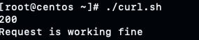
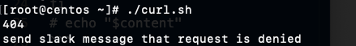

# Curl projects in bash script

1; Task where I use the my public repo, which can be accessed, can be downloaded with curl, it gives me this output:



While using my private repo, which cannot publicly accessed:
```
#!/bin/bash

URL="https://github.com/NazgulM/DevOps"
#echo "%{http_code}"
response=$(curl -s -w "%{http_code}"  $URL)

http1_code=$(tail -n1 <<< "$response")  # get the last line
content=$(sed '$ d' <<< "$response")   # get all but the last line which contains the status code

echo "$http1_code"
if [ $http1_code  == 200  ];
then
                echo "Request is working fine"
        else
        echo "send slack message that request is denied"
fi
# echo "$content"
```

Which gives following output:



