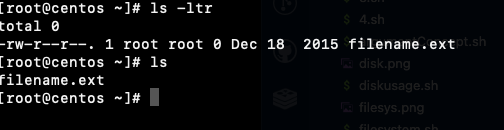
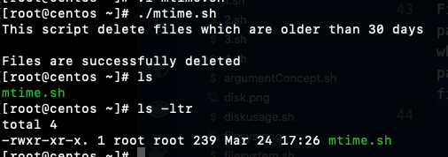

# find command

It can be used to find files and directories and perform subsequent operations on them. It supports searching by file, folder, name, creation date, modification date, owner and permissions.
Can specify any location.

## mtime Command

Modified timestamp indicates the last time the contents of a file was modified. For example, if new contents were added, deleted, ir replaced in a file, the modified timestamp is changed.
+n n greater than n, -n for less than n

Task #1:
In my new created Vm, I doesn't have the any file older than 30 days, I've created one using following commands with specific timeline:

```
touch -a -m -t 201512180130.09 filename.ext
```

So now I have the file from December 08, 2015



```
#!/bin/bash
echo "This script delete files which are older than 30 days"
path="$1"
echo $path
find $path -mtime +30 -delete
if [[ $? -eq 0]];
then
   echo "Files are successfully deleted"
else
   echo "Deletion was having some issue"
fi
```

path="$1"
First argument will be passing to my script, whatever path you will be passing, which older files more than 30 days.

After executed of my mtime.sh file, I can see that my one file from December 08, 2015 was deleted.


