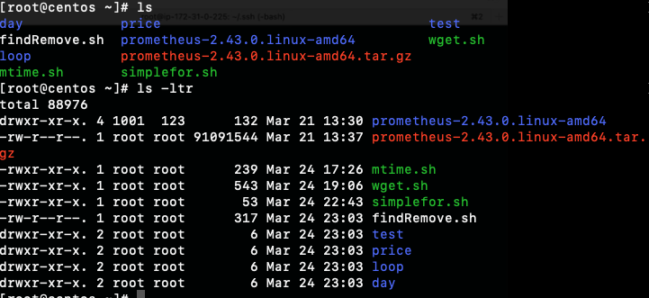
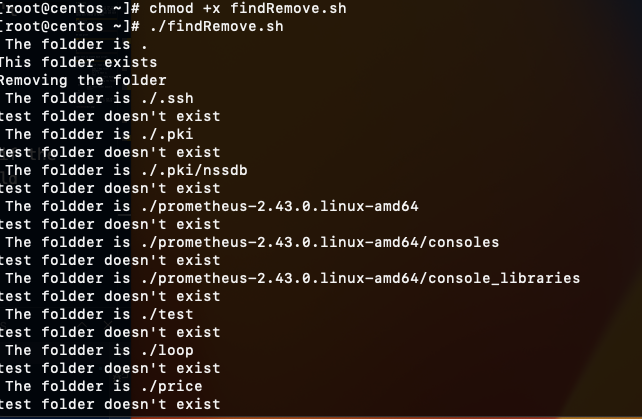

# For Loop

Contains a number of values in the list and will execute for each item in the list. If there are 10 values in the lst, then loop will execute 10 times and each value will stored in varName.

```
#!/bin/bash
for i in 1 2 3 4 5 6
do
    echo $i
done
```

It can print

```
1
2
3
4
5
6
```

Next task is create bash script:

```
#!/bin/bash
for folder in $(find -type d);
do
                echo " The folder is $folder"
                if [ -d test ];
                then
                      echo "This folder exists"
               echo "Removing the folder"
        rm -rf test
  else
           echo "test folder doesn't exist"
  fi
done
```

Script will find the folders, and if the test folder doesn't exist, it should remove this folder



Result:



