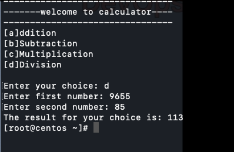
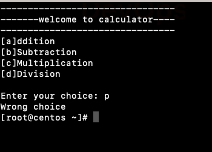
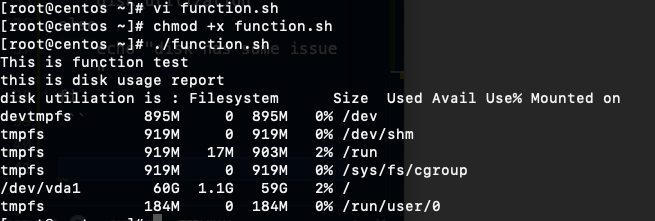

# Functions

Function is a block of code, that is reusable and performs certain operations. Functions help to reuse a code, improve the reliability of the program. make the program modular.

## Case statement

Can use the multiple if.. elif statements or case statements.

```
case word in
   pattern1
   Statement to be executed if pattern1 matches
   pattern2
   Statement to be executed if pattern1 matches
esac
```
In case.sh used echo -e,  -e command, which  enable interpretation of backslash escapes. 





## Function use case
```
#!/bin/bash
echo "This is function test"
disk_utilization()
{
disk=`df -h`
echo "disk utilization is : $disk "
}
if [[ $? -eq 0 ]];
then
    echo "this is disk usage report"
    disk_utilization
else
    echo "disk has some issue "
fi
```



