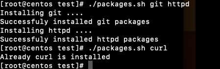

# Command Line Arguments

$0 - It will print the name of script itself

```
#!/bin/bash
echo "This is my shell script name: $0"
echo "This is first argument passed to my script: $1"
echo "This is second argument passed to my script: $2"
echo "This is third argument passed to my script: $3"
if [ $# -eq 0 ];
then
    echo "Please pass at least one argument"
else 
    echo "Arguments passed is $#"
fi
```


$@ - if i do not know the number of arguments

```
#!/bin/bash
# Installing multiple packages

if [[ $# -eq 0 ]]
then
    echo " Usage: please provide software names as command line arguments"
    exit 1
fi


if [[ $(id -u) -ne 0 ]]
then
   echo "Please run from root user or with sudo privilege"
   exit 2
fi


for softwares in $@
do
  if which $softwares &> /dev/null
  then
     echo "Already $softwares is installed"
  else
     echo "Installing $softwares ...."
     yum install $softwares -y &> /dev/null
     if [[ $? -eq 0 ]]
     then 
        echo "Successfully installed $softwares packages"
     else
        echo "Unable to install $softwares"
    fi
  fi
done
```


