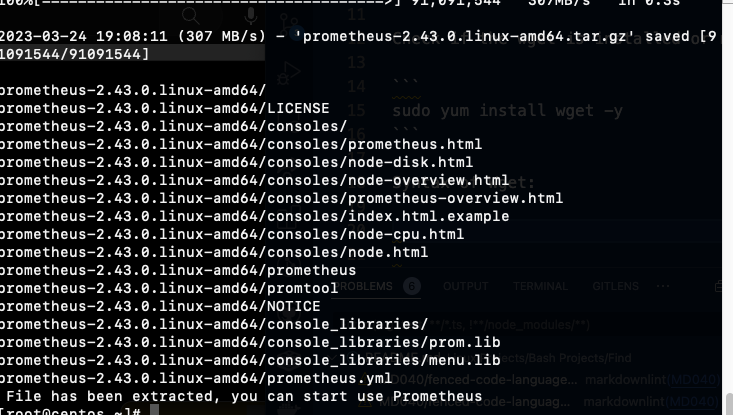

# WGET

## Wget is a free utility for non-interactive download of files from the web

It supports HTTP, HTTPS and FTP protocols and retrieval through HTTP proxies.
Wget is non-interactive, it can work in the background, while the user is not logged on, which allows start a retrieval and disconnect from the system, letting wget finish the work. Most web browsers require constant user interaction, which make transferring a lot of data difficult.

```
rpm -qa | grep wget
```

Check if the wget is installed or not

```
sudo yum install wget -y
```

Syntax of Wget:

```
#!/bin/bash
echo "Download the prometheus binaries"
if [ -e /root/prometheus-2.43.0.linux-amd64.tar.gz ];
then
   echo "file is already existing so no need to download"
   tar -zxvf /root/prometheus-2.43.0.linux-amd64.tar.gz 
else
   echo "Binary does not exist in system first we need to download it"
   wget https://github.com/prometheus/prometheus/releases/download/v2.43.0/prometheus-2.43.0.linux-amd64.tar.gz
   tar -zxvf /root/prometheus-2.43.0.linux-amd64.tar.gz 
   echo " File has been extracted, you can start use Prometheus"
fi
```

In this script, if this prometheus exist, please extract, -z (unzip), -x(extract), -v varvose (will show the progress of extracting), -f (forcefully, don not have to enter any prompt), if not download and extract.


