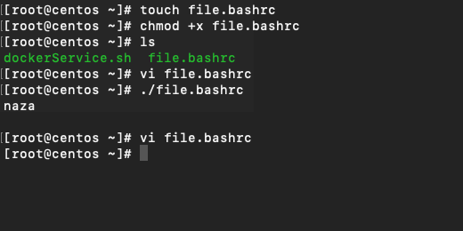
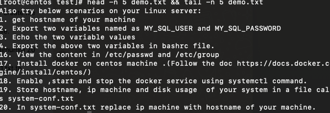

# Linux scenarios

1. get hostname of your machine
2. Export two variables named as MY_SQL_USER and MY_SQL_PASSWORD
3. Echo the two variable values
4. Export the above two variables in bashrc file.
5. List all hidden files in your home directory.
6. Create a directory in your home folder named as test and inside the test folder create file my_intro with content as your name.
7. Create a file demo.txt using touch command and write around 20 lines in this file.
8. Print the output of first 5 lines from demo.txt and then last 5 lines .
9. find all the files inside your home directory whose last modification date is minimum 20 minutes .Note:use man command to see arguments
10. create a file server.txt in /home and then move server.txt with name as server1.txt to /home/random directory . Note you need to create random directory here.
11. Delete the file server1.txt and the directory /home/random
12. Create a group named as demo .
13. create a user with your name in the group demo .
14. Using change command change the password for your user.
15. Create a user with directory assigned as /var/lib.
16. View the content in /etc/passwd and /etc/group
17. Install docker on centos machine .(Follow the doc <https://docs.docker.com/engine/install/centos/>)
18. Enable ,start and stop the docker service using systemctl command.
19. Store hostname, ip machine and disk usage  of your system in a file called as system-conf.txt
20. In system-conf.txt replace ip machine with hostname of your machine.
21. Ping myntra website and check if server is reachable or not.
22. Kill the process running for your docker using kill command .
23. Create three users A,B and C.
24. Create a group D , assign B and C user to that group.
25. Create a file devops.txt with user A.
26. Give Read,write and execute permission to Group D for devops.txt.Check if User B can modify the content of file and save it .
27. Change the owner of devops.txt to User C.

```
1. hostname -f
2. export MY_SQL_USER=naza
export MY_SQl_PASSWORD=password
3. Echo the two variable values
echo $MY_SQL_USER
naza
echo $MY_SQL_PASSWORD
4. Export the above two variables in bashrc file.
#!/bin/bash
echo $MY_SQL_USER
echo $MY_SQL_PASSWORD
```



```
5. List all hidden files in your home directory.
ls -latr
6. Create a directory in your home folder named as test and inside the test folder create file my_intro with content as your name.
mkdir test && cd test && echo "naza" > my_intro
7. Create a file demo.txt using touch command and write around 20 lines in this file.
Done
8. Print the output of first 5 lines from demo.txt and then last 5 lines 
head -n 5 demo.txt && tail -n 5 demo.txt 
```


