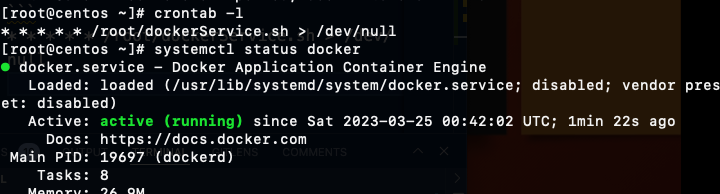

# The Crontab

The crontab is a list of commands which we want to run in regular interval, Crontab stands for cron table, because it uses the jpb scheduler cron to execute tasks, cron itself is named after "chronos", the Greek word or time.cron is the system process which is automatically perform tasks according to set a schedule. The schedule called as crontab.

MIN - 0 to 59
HOUR - 0 to 23
DOM (Day of month) - 1-31
MON (Month field) - 1-12
DOW (Day of week) - 0-6
CMD - Command

30 08 10 06 - 10th June  08:30 Am

Other way to work crontab in our Vm

```
* * * * * /root/dockerService.sh > /dev/null


