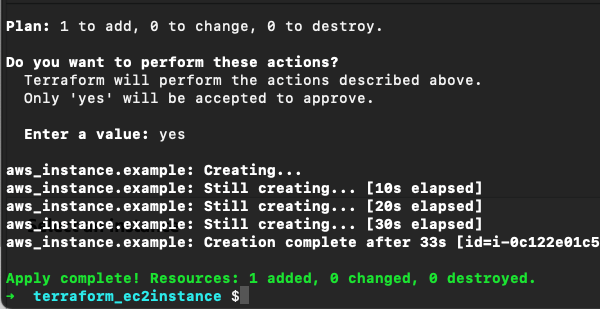
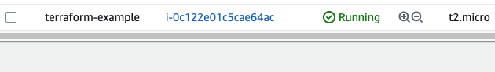
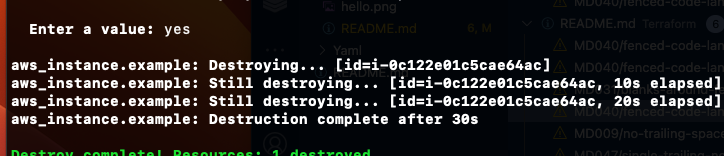

# Create first EC2 instance

```
provider "aws" {
  region = "us-east-2"
}

resource "aws_instance" "example" {
  ami           = "ami-0fb653ca2d3203ac1"
  instance_type = "t2.micro"

  tags = {
    Name = "terraform-example"
  }
}
```

```
terraform init 
# This tells terraform to scan the code, figure out which providers you are using, and download the code for them.

terraform plan
The plan commands lets you see what Terraform will do before actually making any changes

terraform apply 
It will create the EC2 instance
```






