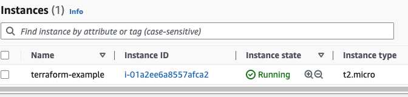
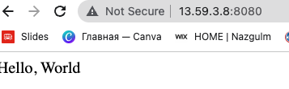

# Terraform

Infrastructure as a code tool.
Open source - freely available, you can use it while need it.
Manage infra for multiple cloud providers - it can be various clouds
Simple
Declarative programming language
Easy to manage infra with few cli commands
Faster and reliable
Maintain history of changes
Code reviews and automated tests
All your servers, all your systems, whole Infrastructure you are performing as a code.

Top 10 IaaC tools:
Chef, Puppet, Ansible, Pulumi, AWS CloudFormation, Terraform, Google Cloud Deployment Manager, Vagrant

Different parts of tools:
Chef, Puppet, and Ansible are all configuration management tools, they are designed to install and manage software on existing servers. AWS CloudFormation, Heat, Pulumi, Terraform are provisioning tools, they are designed to provision the servers themselves (as well as the rest of the infrastructure, like load balancer, databases, networking configuration etc), leaving the job of configuring those servers to other tools.

Configuration management tools such as Chef, Puppet, Ansible typically default to a mutable infrastructure paradigm. If you are using Terraform to deploy machine images created by Docker or Packer, most changes are actually deployments of a completely new server.

Chef and Ansible encourage a procedural style where you write a code that specifies, step by step, how to achieve some desired end state. Terraform, CloudFormation, Pulumi, Heat and Puppet all encourage a more declarative style where you write code that specifies your desired end state, and the Iac tool itself is responsible for figuring out how to achieve this state.

Practice 1; Create an EC2 instance using Terraform:

```
mkdir terraform-directory/
export AWS_ACCESS_KEY_ID="YourAccessKeyId"
export AWS_SECRET_ACCESS_KEY="yourSecretAccessKey"

vi main.tf
provider "aws" {
  region = "us-east-2"
}

resource "aws_instance" "example" {
  ami                    = "ami-0fb653ca2d3203ac1"
  instance_type          = "t2.micro"
  vpc_security_group_ids = [aws_security_group.instance.id]
  user_data = <<-EOF
              #!/bin/bash
              echo "Hello, World" > index.html
              nohup busybox httpd -f -p 8080 &
              EOF

  user_data_replace_on_change = true

  tags = {
    Name = "terraform-example"
  }
}


resource "aws_security_group" "instance" {
  name = "terraform-example-instance"
  ingress {
    from_port   = 8080
    to_port     = 8080
    protocol    = "tcp"
    cidr_blocks = ["0.0.0.0/0"]
  }
}

terraform init
terraform plan
terraform apply ---auto-approve          
Skip interactive approval of plan before applying.
```





Master Versus Masterless
chef and puppet that you run a master server for storing the state of your infrastructure and distributing update. Ansible, CloudFormation, Heat, terraform, and pulumi are all masterless by default

Agent Versus Agentless
Chef and Puppet require you t install agent software (e.g. Chef Client, Puppet Agent) on each server that you want to configure.
Ansible, CloudFormation, Heat, Terraform, and Pulumi fo not require you to install any extra agents.

Paid versus free offering
CloudFormation and openStack hear are completely free: the resources you deploy with those tools cost money, but you don't pay anything to use these tools. Terraform, Chef, Ansible, Puppet and Pulumi are all available in free versions and paid versions.

Using multiple tools together
Provisioning plus configuration management.
Provisioning plus server templating.
Provisioning plus server templating plus orchestration.

Terraform can provision infra across public clouds Azure, Google Cloud, DigitalOcean, AWS, as well as private cloud providers such as VmWare and OpenStack.

```
Install terraform on MacOs
